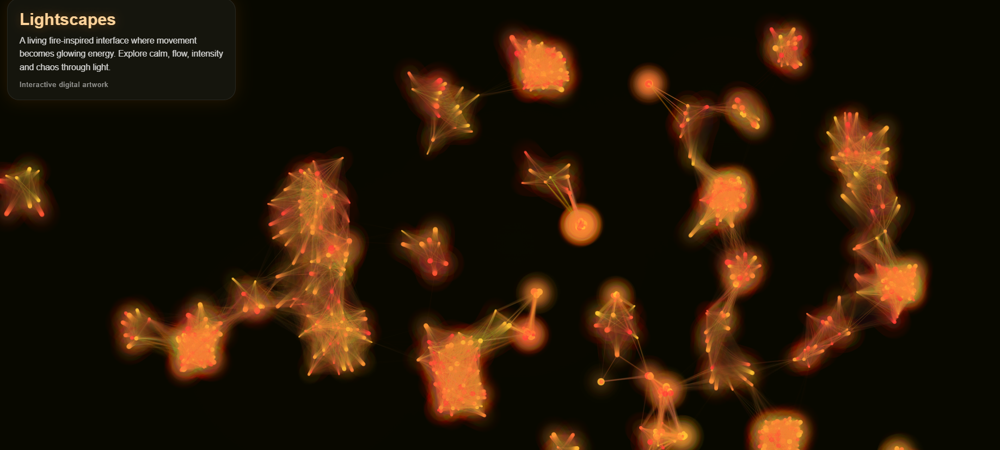

  

# ✶ Lightscapes – Fire Interface

⟡ ✧ ⟡

A fire-inspired digital artwork where movement becomes glowing energy.

---

## ✦ Concept

This project explores interaction through warmth, motion and luminous intensity.  
Mouse movement generates living particles in shades of red, orange, gold and yellow.

---

## ✦ Modes

- Calm
- Flow
- Energy
- Chaos

---

## ✦ Live Preview

https://designlili.github.io/lightscapes-fire-interface/

---

## ✦ Created by

Lili Kárándi  
Artist | Lightscapes Creator
